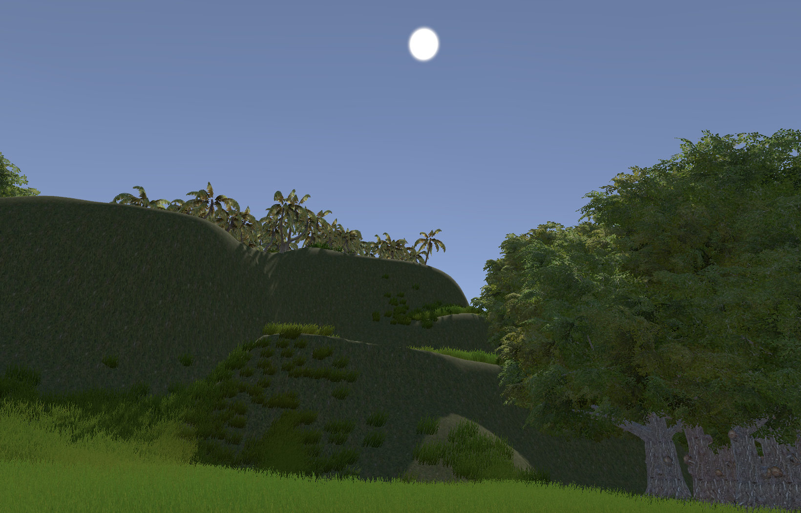
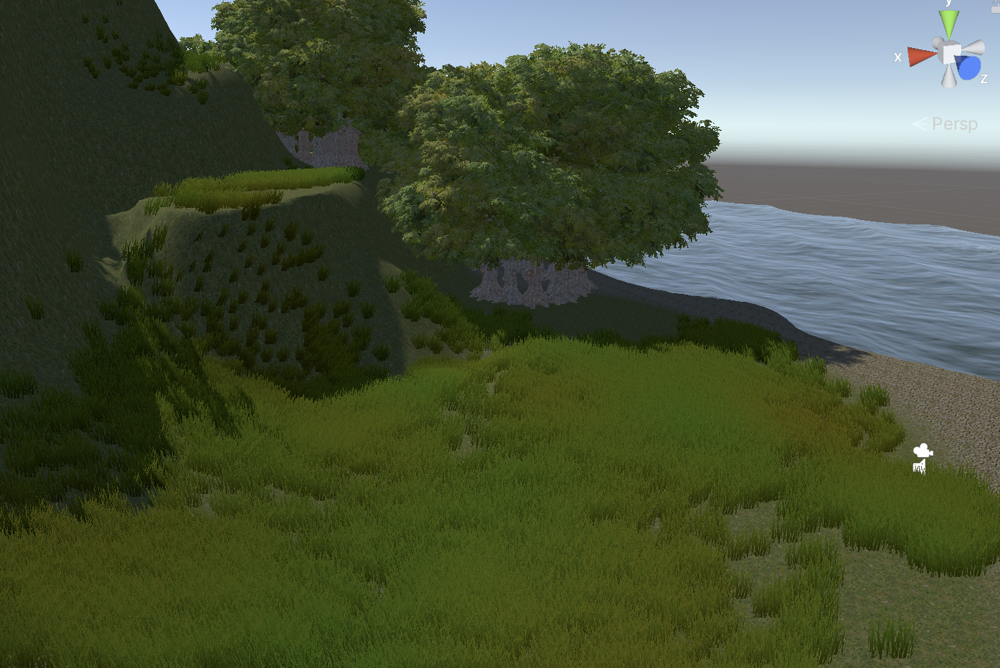
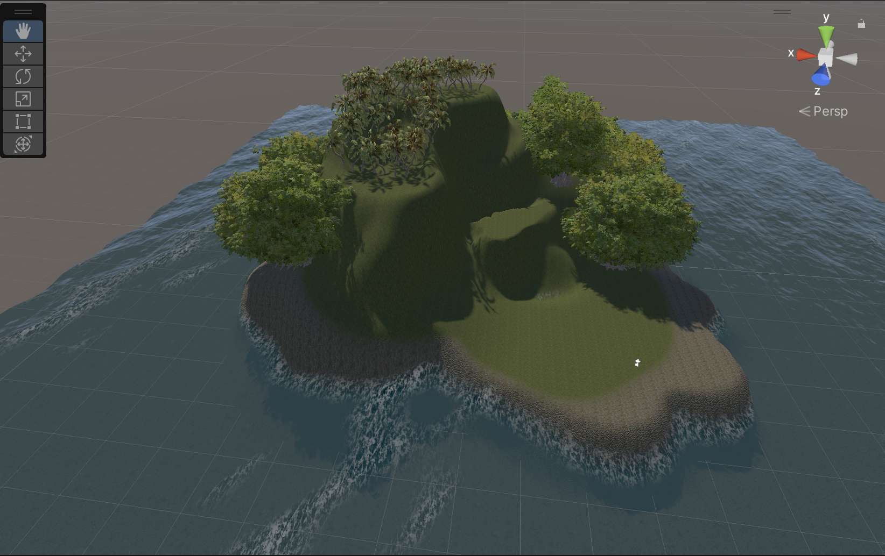
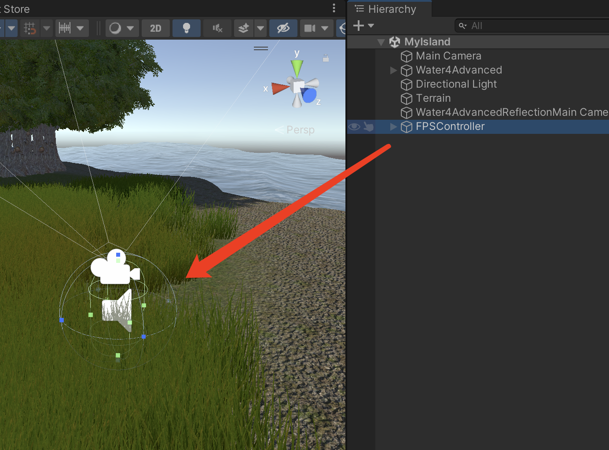

# MOOC 游戏引擎及原理

## 游戏引擎原理及应用作业

### 地形作业

> 新建一个Unity工程，然后自己独立创建一个场景，场景中需要用到Asset store中的免费资源，用到地型编辑功能，使场景中的物体丰富美观。

我的作业: 
* 一个海岛的地形场景 
* [作业源码地址](https://github.com/EricHYF/unity_mooc_homework)
- 

制作内容: 
* 使用了地形工具建立基础的地形和装饰物, 
  * 利用地形工具内的 SetHeight 来设置地形升降, 利用 Smooth 工具来平滑高地的倒角, 平滑起伏的地形
  * 使用了添加树木的工具构建了多种样式的树木 (作业中使用了2种)
  * 使用草丛工具添加了草地.
  - 
* 使用了标准资源库内的水面组件来构成周边的海洋效果.
- 
* 使用了标准资源库内的 FPSController 来确保预览效果
* - 

PS:
* 作业中使用的 Standard Assets 资源包, 如果无法在网上找到的话, 可以来我的repo中[下载](https://github.com/EricHYF/unity-standard-assets-backup)