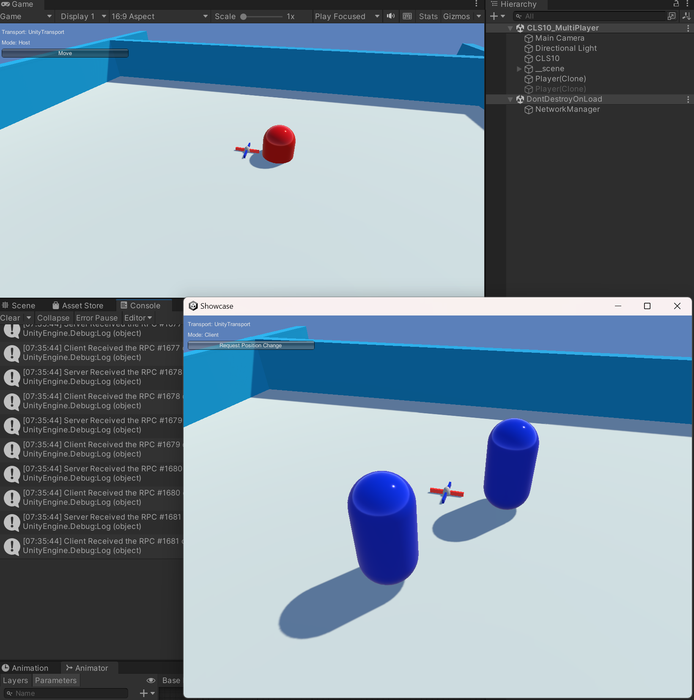

本次作业让我们熟悉一下 Unity.Netcode的用法. 来制作一个简单的多人连线机制


首先, 先在 PM 中安装必要的组件 Netcode for GameObjects:


简单制作一下场景必要组件

- 场景中建立一个物体, NetworkManager, 物件上挂载 NetworkManager 脚本. 并设置一下初始化属性:


- 制作一个3D的一个胶囊作为玩家对象, 命名为 Player, 为它添加一个脚本 <HelloWorldPlayer> 用于实现启动的随机移动:

```C#

public class HelloWorldPlayer : NetworkBehaviour
    {
        public NetworkVariable<Vector3> Position = new NetworkVariable<Vector3>();

        public Renderer _renderer;
        public Material[] _mats;

        public override void OnNetworkSpawn()
        {
            if (IsOwner)
            {
                Move();
            }
            if (IsClient)
            {
                _renderer.material = _mats[1];
            }
            if (IsHost)
            {
                _renderer.material = _mats[0];
            }
        }

        public void Move()
        {
            SubmitPositionRequestServerRpc();
        }

        [Rpc(SendTo.Server)]
        void SubmitPositionRequestServerRpc(RpcParams rpcParams = default)
        {
            var randomPosition = GetRandomPositionOnPlane();
            transform.position = randomPosition;
            Position.Value = randomPosition;
        }

        static Vector3 GetRandomPositionOnPlane()
        {
            return new Vector3(Random.Range(-3f, 3f), 1f, Random.Range(-3f, 3f));
        }

        void Update()
        {
            transform.position = Position.Value;
        }
    }

```

- 将制作好的 Player prefab 挂载到 NetworkManager 的 Player Prefab 属性上. 让它可以在各个客户端中生成.
- 编写代码, 控制在游戏启动时. 根据 客户端的类型来显示对应的颜色
- GUI 上添加一个 脚本用于设置启动模式

编写完成后, 可以打包构建一个 PC 的可执行包体. 这样可以满足下面的多端启动:


先在Editor内运行游戏, 同时打开已经构建好的App

- Editor内选择 HOST
- App 内选择 Client


可以看到 Client 已经可以同步 Host 内移动中的Player 的坐标了





以上Demo可完成简单的多人网络连线的逻辑。


作业制作不易， 希望大家能打10分。 作业互评只要有内容一律给10分！