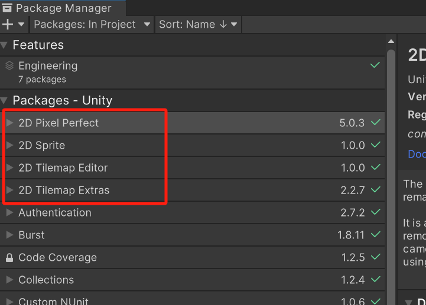
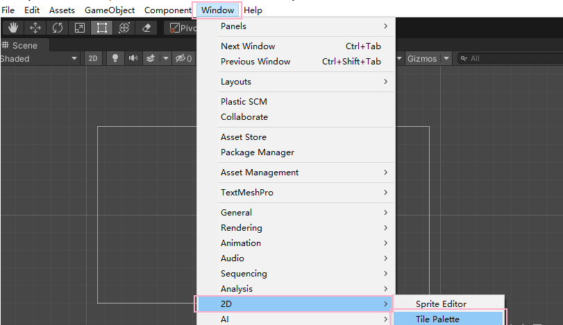
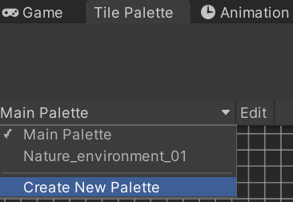
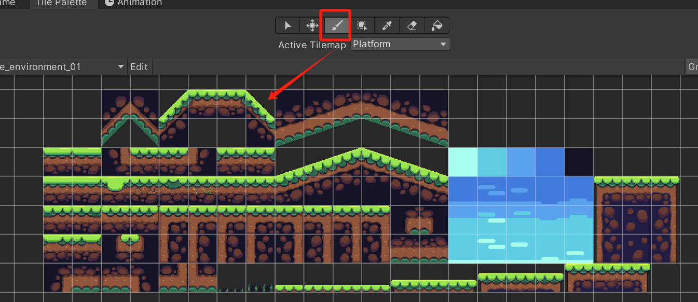
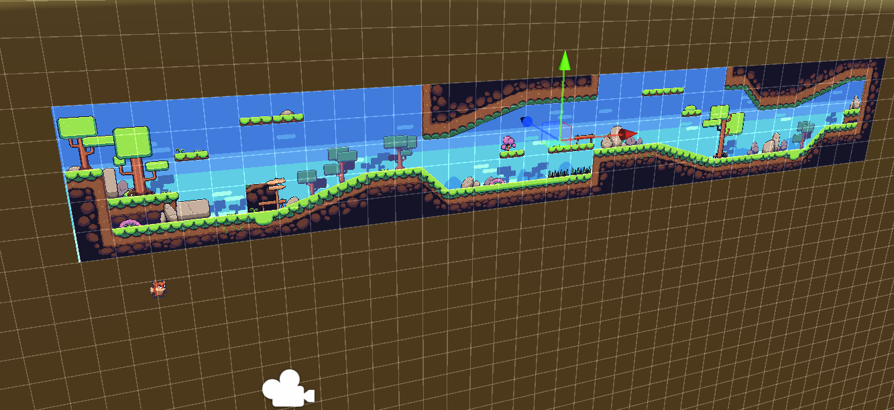
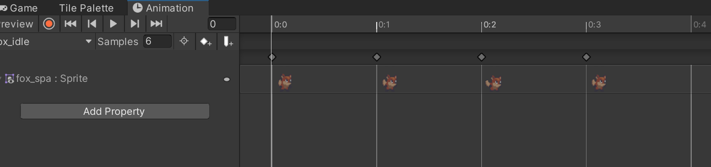
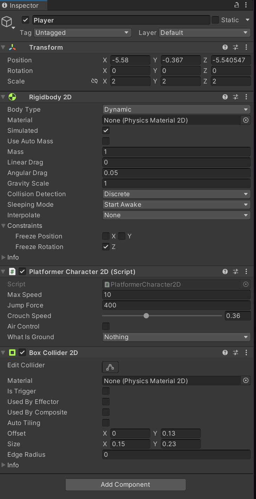
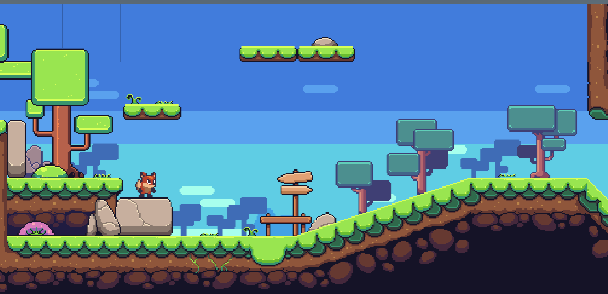

# CLS10 使用Unity实现一个简单的2D游戏场景。

本次的作业是做一个简单的2D场景, 让我们开始

首先从网上找一些免费的2D场景资源和人物素材

在PackageManager 内安装如下插件:

打开瓦片地图调色板 TilePalette, :

选择创建 Create New Palette. 将预先制作好的瓦片地图素材拖入调色板. 并设置好网格的大小

使用画笔工具进行编辑并绘制场景:

编辑一个简单的2D场景和地图:

然后再这个小的Demo添加对应的角色:

新建一个Player 对象, 并给其添加一个人物专用的  SpriteRender ,

在这个 人物对象上添加一个 Animator, 导入对应的关键动画.   并编辑各种状态

添加官方标准组件中的2D人物控制器,

一个可交互的场景基本就完成!

作业制作不易， 希望大家能打10分。 作业互评只要有内容一律给10分！