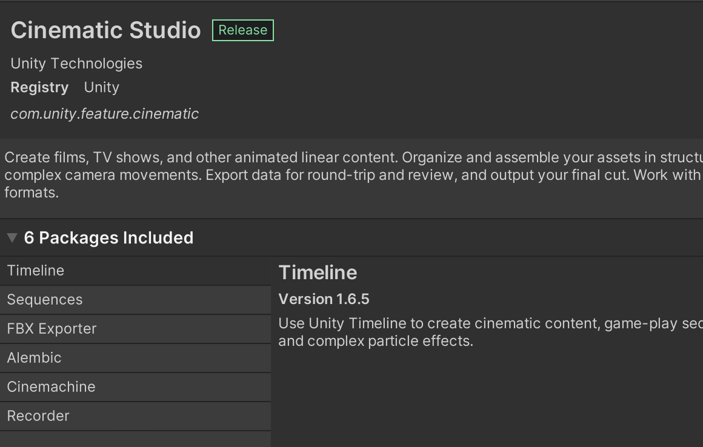
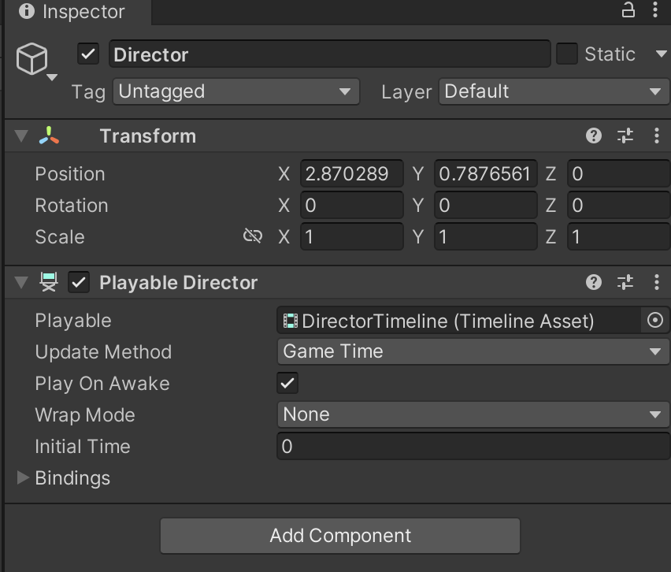
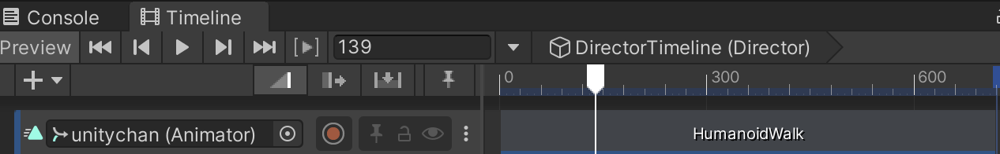
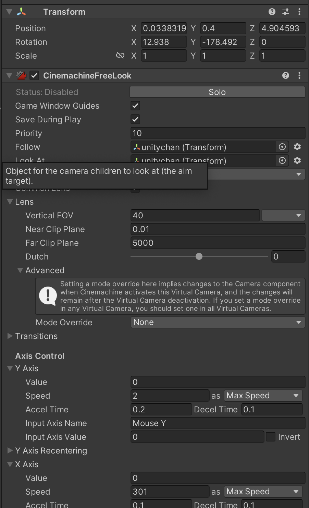
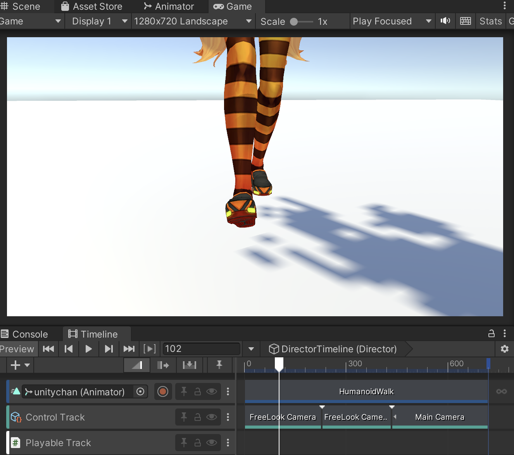
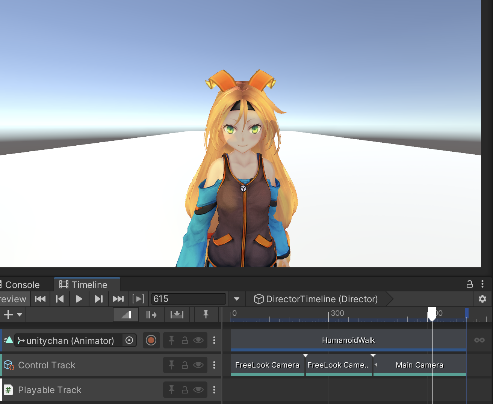

# 本次的作业是利用 Timeline 制作一段影片。

我们先从 Pakcage Manager 内导入 Cinmachine 等必要的插件

然后再场景中创建一个空物体， 并附加脚本

之后建立简单的场景导入之前课程中用过的任务建模和对应的人物建模：

在 Director 的 Timeline 上建立一个 Animation 轨道用于控制人物的动画播放

然后建立几个 FreeLook 的 摄像机用于切换镜头机位：

在 TimeLine 上建立 Control 轨道， 用于控制跟踪镜头的切换：

最后是切镜效果

Demo制作不易, 希望大家给与好评! 祝大家都可以顺利完成作业!