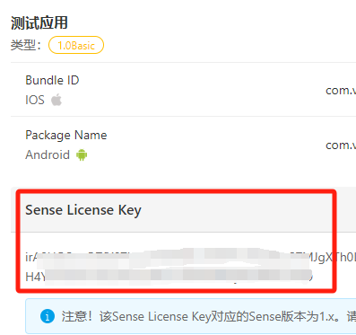
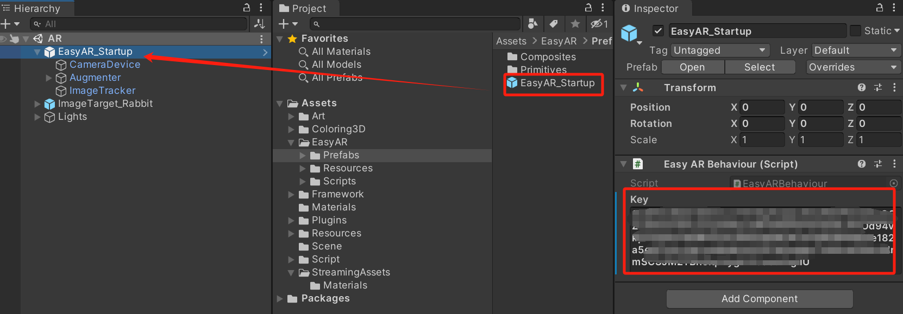
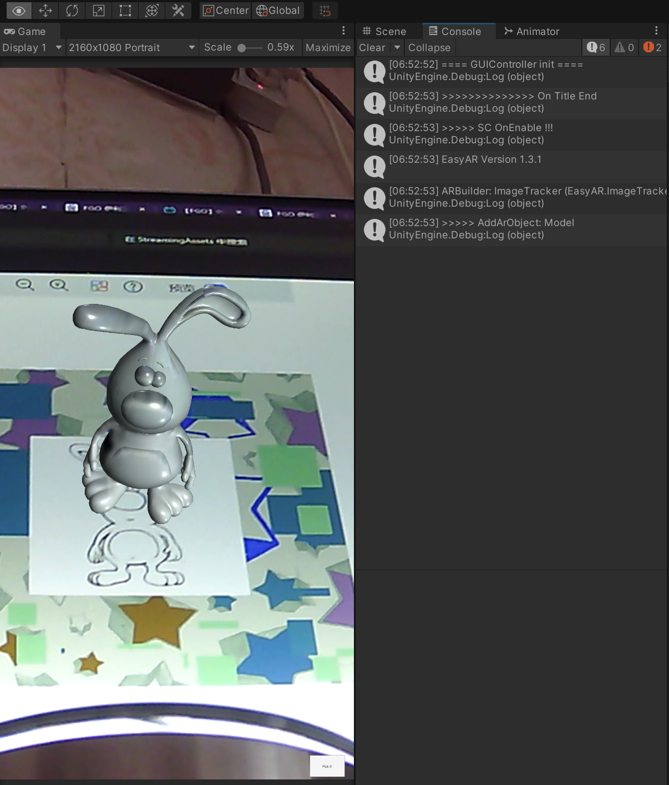

# 本次的作业是制作一个简单的 AR 程序。

项目借助了EasyAR 这个工具, 先从网上下载 EasyAR 的插件, 并进行配置:

https://www.easyar.cn/view/sdk.html

注册一个账号并, 配置一下自己的许可证秘钥:

下载 unitypackage 并导入项目, 

创建一个场景, 将 EasyAR/Prefabs 内的 EasyAR_Startup 组件拖入场景, 配置一下之前生成的秘钥:

将 ImageTarget 拖入场景, 在组件年内绑定一下 AR 可识别的目标图像

完善一下代码调用并置入对应的控制逻辑:

连接摄像头进行测试

Demo制作不易, 希望大家给与好评! 祝大家都可以顺利完成作业!