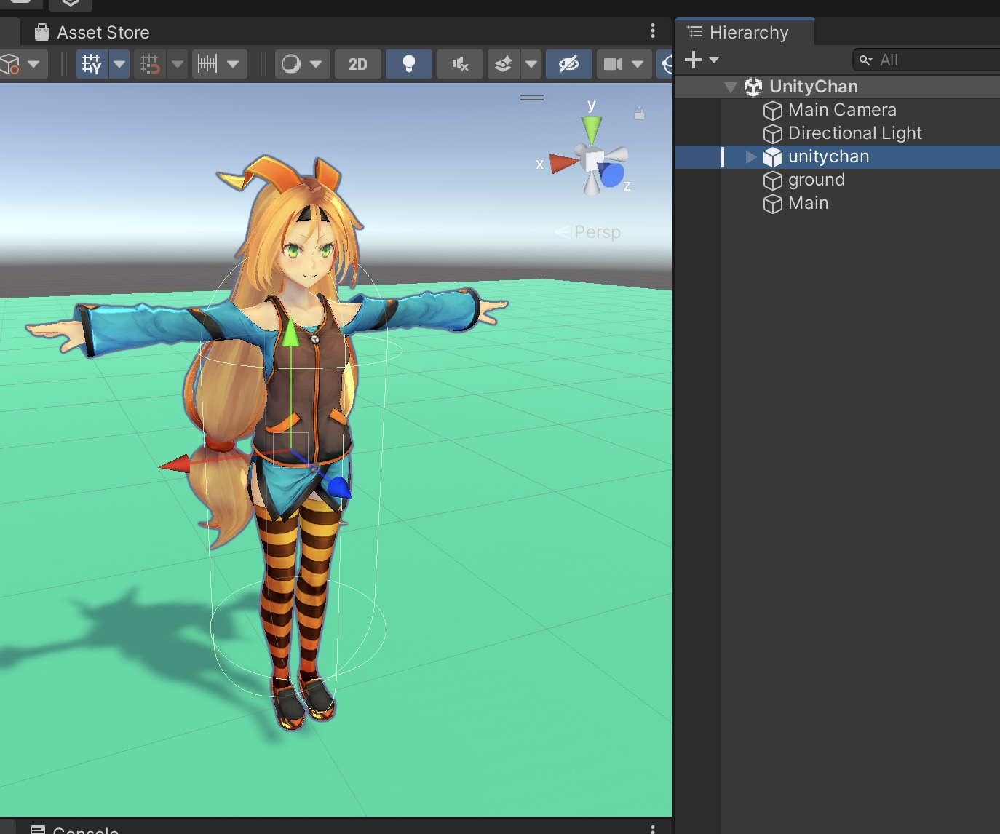
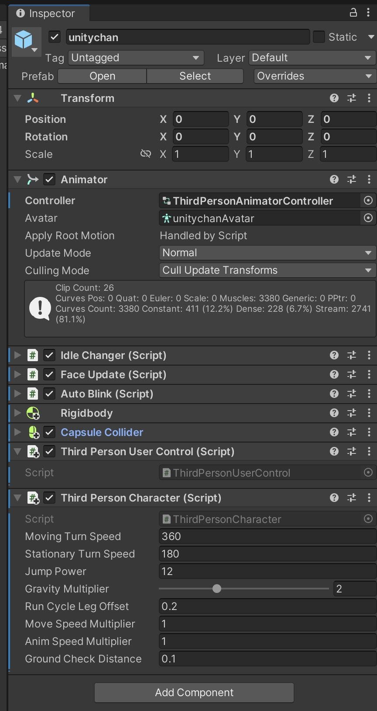
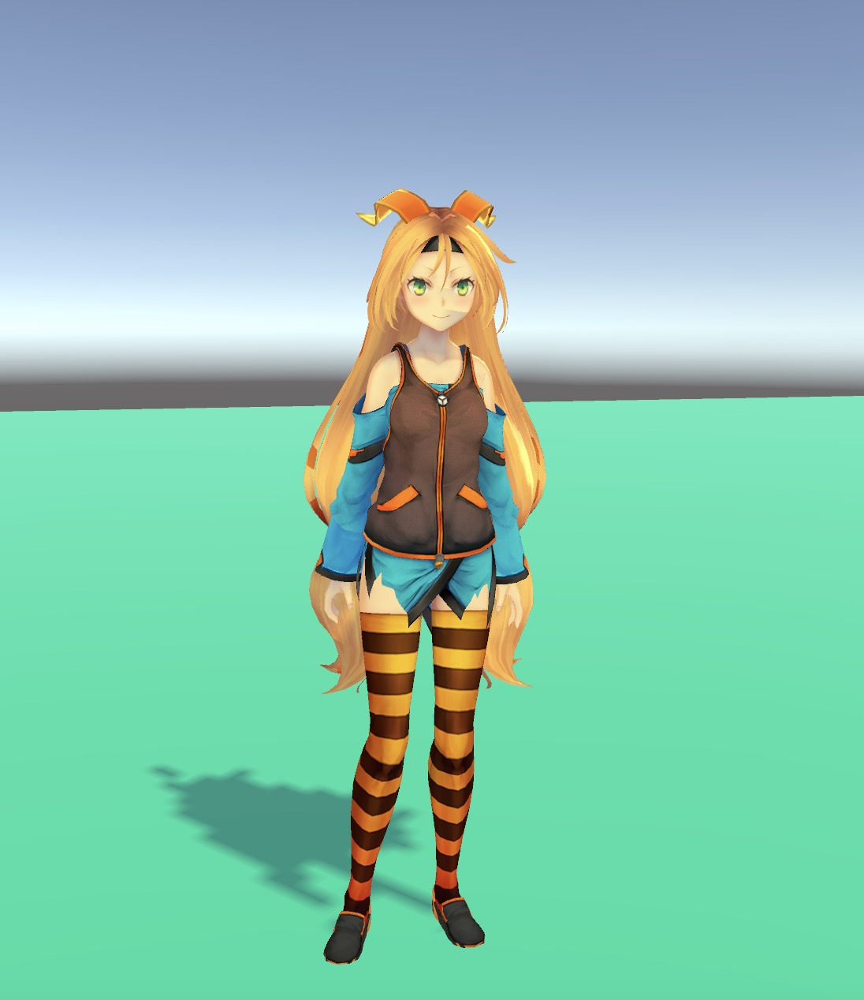
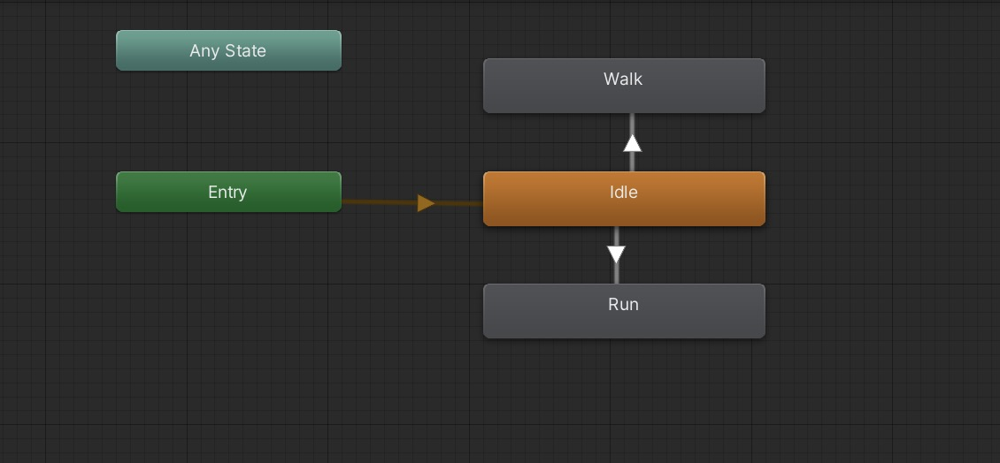
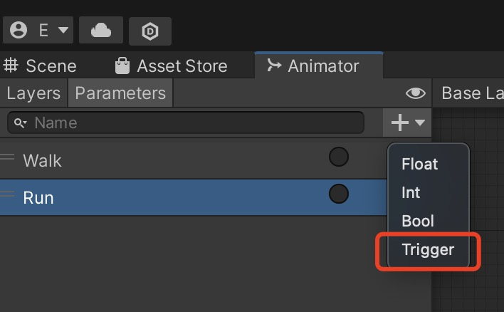
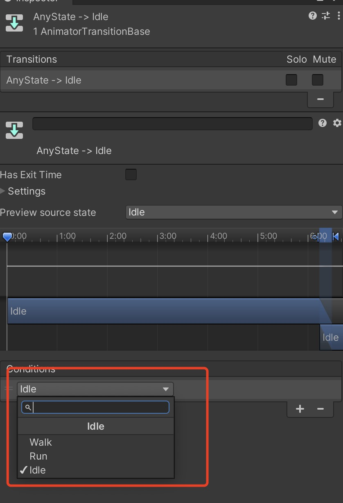

# MOOC 游戏引擎及原理

> (2) 新建一个场景，将unity-chan资源下载到本地，然后创建一个可以控制多个动作的动画控制系统。

本次的作业, 我们首先去 Asset Store [下载 Unity-Chan 的资源包](https://assetstore.unity.com/packages/3d/characters/unity-chan-model-18705):

导入后, 我们将 unity-chan 的 Prefab 拖动到场景内, 在上面增加一个 Animator 的组件, 并且用 box 给她建立一个地面.


## 第一种方式:

增加一个 `ThirdPersonUserControl` 组件, 并且将 Animator 上的动画控制器设置为 `ThirdPersonAnimatorController`


这样一运行场景, 通过使用 WASD 或者 上下左右 箭头就可以控制人物移动了.

这种方式很方便, 不用编写代码, 是 Unity Standard Assets 中标准的人物控制组件.

---

## 第二种方式:

将 unity-chan 拖动到场景内, 给她添加一个 Animator 组件.

自己建立一个 Animator controller 组件, 并设置到 Animator 的 controller 上面

在 Animator 窗口内为人物创建几个动作状态机, 并挂载上对应的人物动画 Clip

* Idle
* Walk
* Run


创建几个trigger 对象:


在每个箭头上点击右键, 在动作条件上设置对应的 condition 条件:


然后建立一个脚本, 通过监听键盘的键位来设置动画 Animator 的 trigger 值, 从而改变角色的动作:

添加到人物身上后, 可以将动画控制器挂载到脚本的 girlAnimator 组件上

然后点击开始场景,:
* 按住 W 就是走路
* 按住 R 就是跑步
* 松开就是待机动作

```C#

using System.Collections.Generic;
using UnityEngine;

public class GirlDemoMain : MonoBehaviour
{
/// <summary>
/// 挂载动画组件
/// </summary>
public Animator _girlAnimator;

    // Start is called before the first frame update
    void Start()
    {
        
    }
    // 简单的键位判断
    void Update()
    {
        //----------- 行走动画 --------------
        if (Input.GetKeyDown(KeyCode.W))
        {
            _girlAnimator.SetTrigger("Walk"); // 这里设置走的 trigger 名称
        }
        if (Input.GetKeyUp(KeyCode.W))
        {
            _girlAnimator.SetTrigger("Idle"); // 这里设置待机的 trigger 名称
        }

        //----------- 跑步动画 --------------
        if (Input.GetKeyDown(KeyCode.R))
        {
            _girlAnimator.SetTrigger("Run"); // 这里设置跑的 trigger 名称
        }
        if (Input.GetKeyUp(KeyCode.R))
        {
            _girlAnimator.SetTrigger("Idle"); // 这里设置待机的 trigger 名称
        }

    }
}

```

最后祝大家玩的开心!


源码[点击此处下载](https://github.com/EricHYF/unity_mooc_homework)
