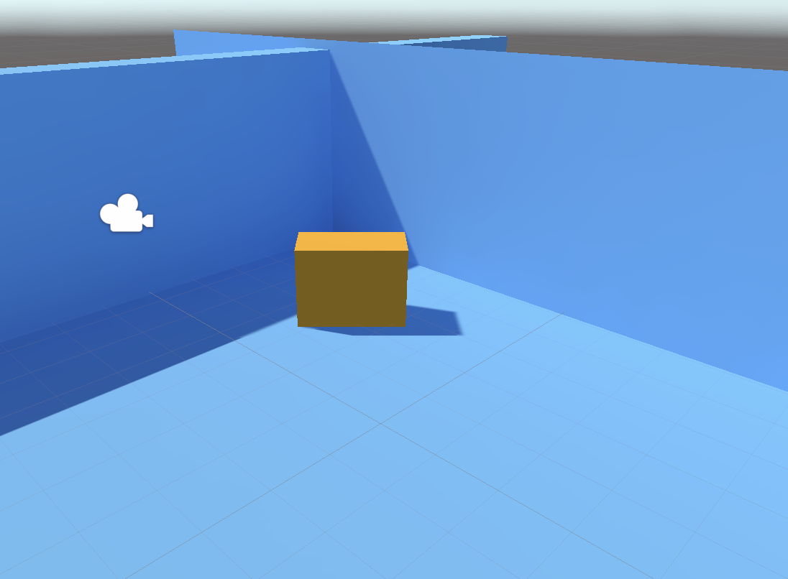
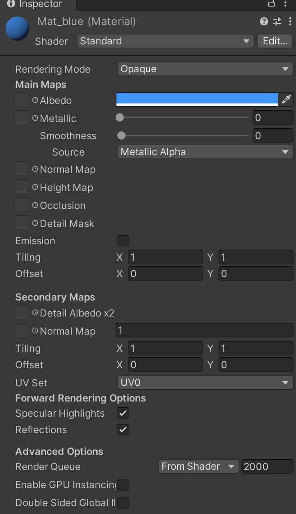
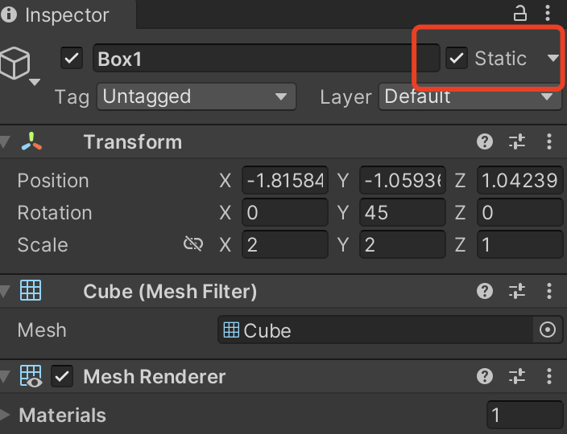
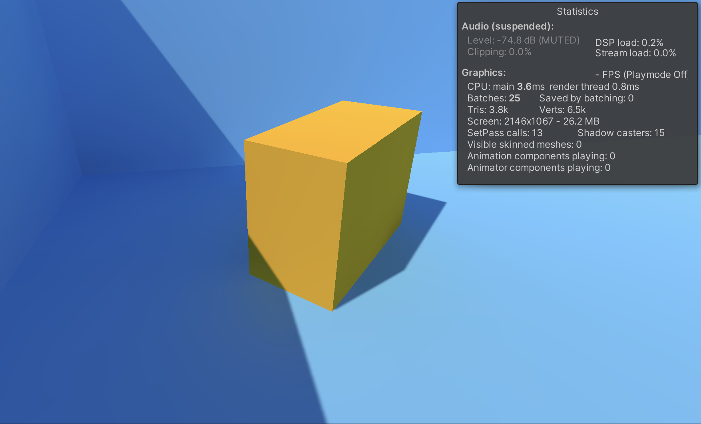
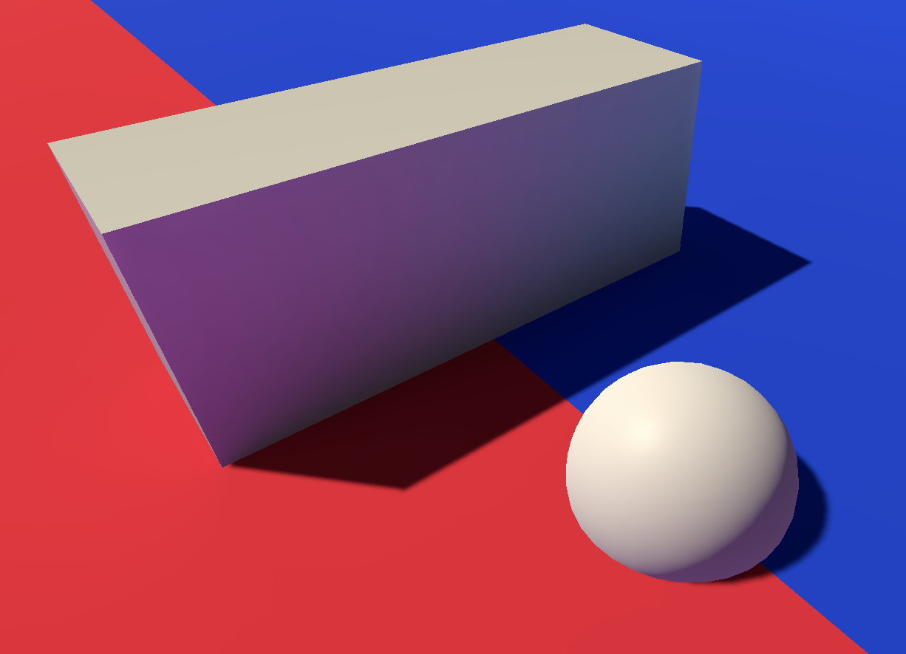
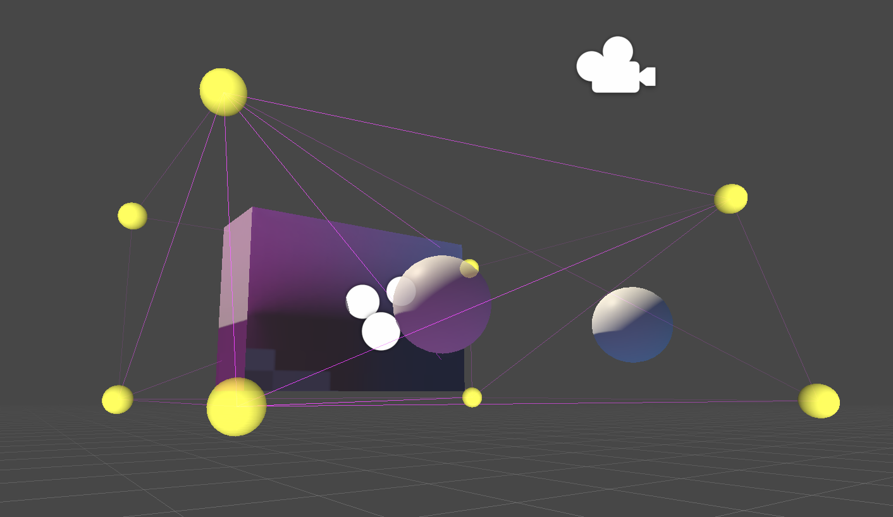

# MOOC 游戏引擎及原理

> (3) 建立一个精美的渲染场景，场景包含静态和动态游戏物体，进行GI烘焙，并使用探针。

本次作业我们首先建立一个场景, 按照教程内的步骤建立plane构成地面和墙壁. 然后在场景内放置一个BOX.

然后建立两个materials, 分别设置蓝色和橙色. 将蓝色的材质球赋给墙壁和地面, 将橙色的材质球赋给BOX.

将场景内的BOX 和墙壁物体设置为 static 属性

然后开启灯光设置, 开始渲染全局光照烘焙, 最终效果如下:

阴影较为柔和, setpasscall 数量为13 尚可:

---------------- 光照探针 ------------------------

新建一个场景, 用两个plane 拼接两个地面, 并赋给不同的颜色, 新建一个BOX, 进行烘焙

可见环境光已经可以影响到BOX物体

然后新建一个 `Light Probe Group` 光照探针组,  设置合适的区域, 并在其中新建一个非静态的小球:

可见, 小球受到光照探针的影响, 也呈现了环境色:

以上

------------------------------------------------------------------

最后祝大家玩得开心

源码[点击此处下载](https://github.com/EricHYF/unity_mooc_homework)
