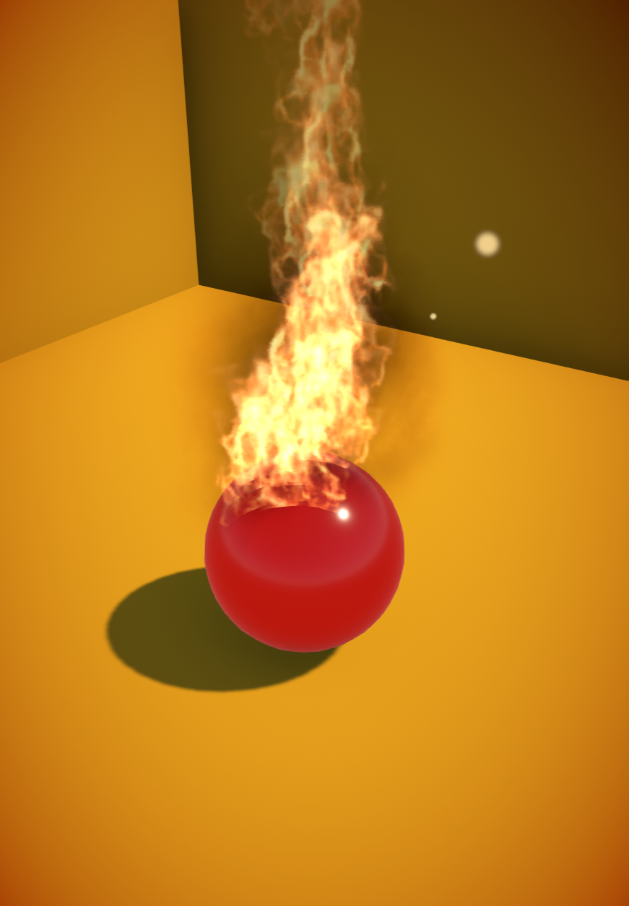
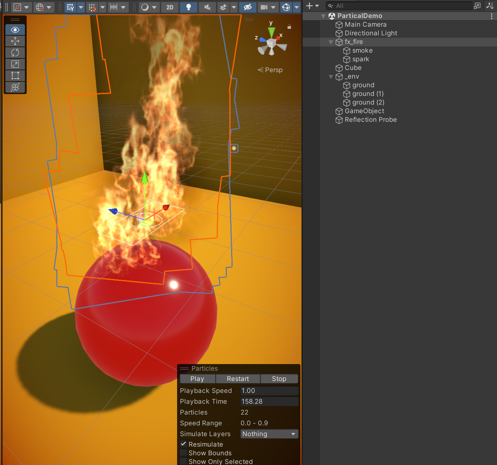
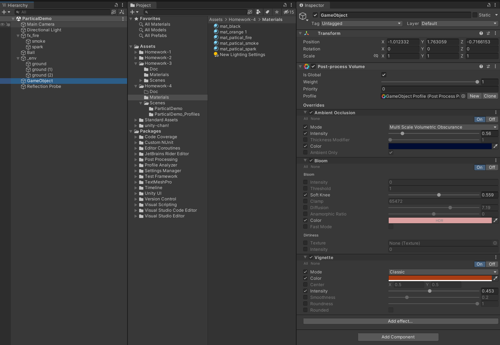

# MOOC 游戏引擎及原理

> (4) 制作一个真实的火焰特效，包含火焰的多个层次，烟尘，火星，可以添加后处理效果。

先看一下本次作业的最终效果:

本次按照视频教程, 先建立了火焰特效和烟雾特效, 然后自己补全了基于 Cone 形状的发散的火星特效:

之后继续和老师学习, 安装了Post Process 插件来完成摄像机和全局的后期特效

调整了抗锯齿, 阴影, 遮蔽,  达成最终的效果

最后祝大家都能顺利完成作业, 谢谢!