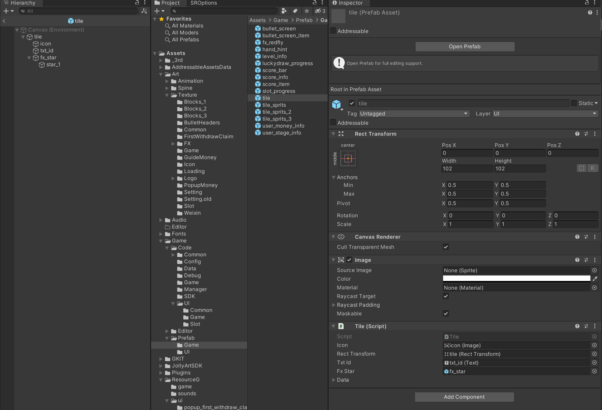
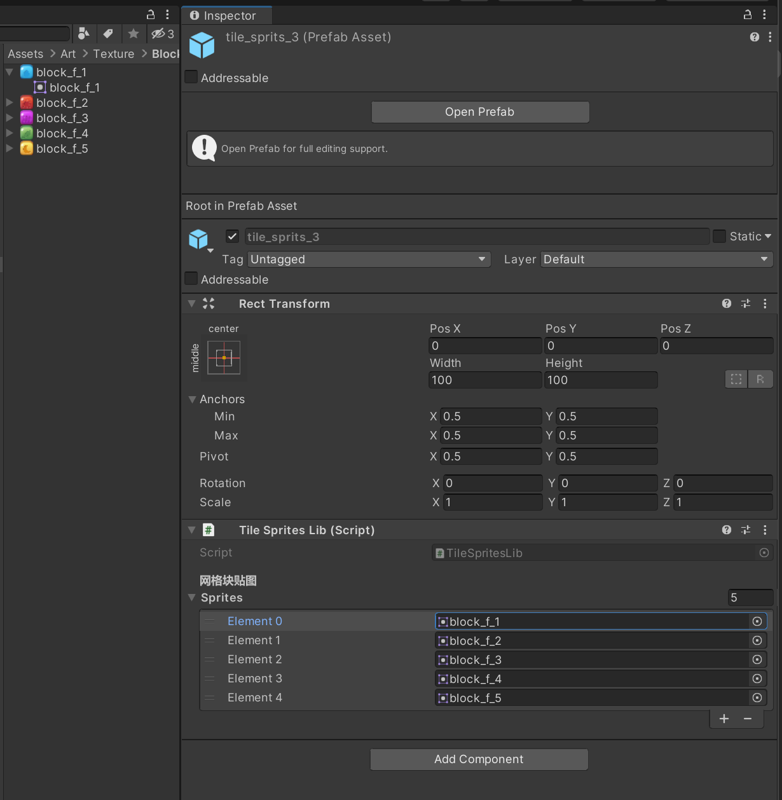
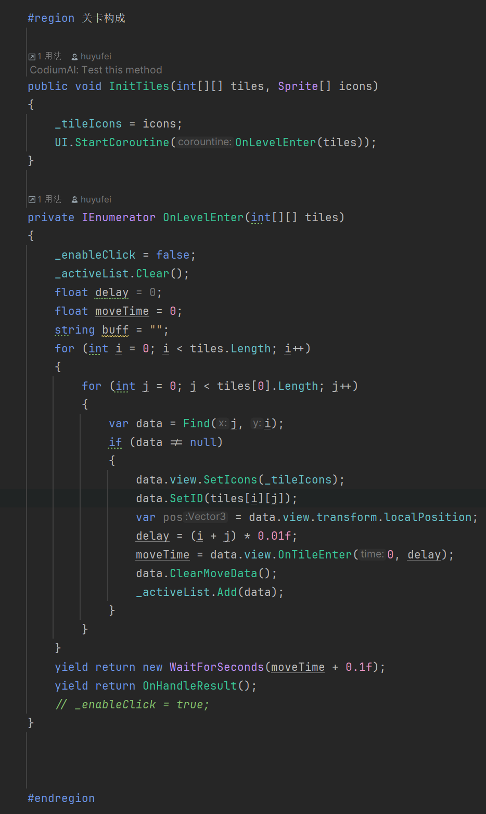

# MOOC 游戏引擎及原理

> (5) 尝试做一个简单场景或者开发一个简单的小游戏，运用到脚本和预制件，并考虑协程可以用在游戏的哪些地方。

分享一下之前做的消除游戏的Demo:

游戏的砖块使用了预制体来制作:

每个砖块内置的 Image 使用了场景中预设的 Tile_Sprite 组件来进行配置和赋值:

在场景启动的时候, 使用了协程来启动砖块入场的效果:

其他细节欢迎大家在群内讨论.

Demo制作不易, 希望大家给与好评! 祝大家都可以顺利完成作业!

