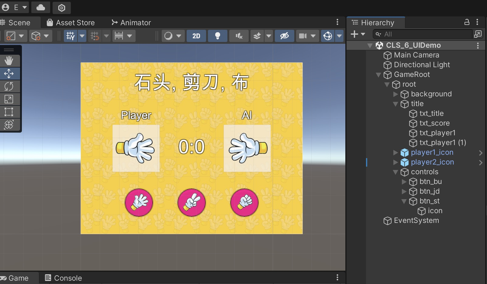
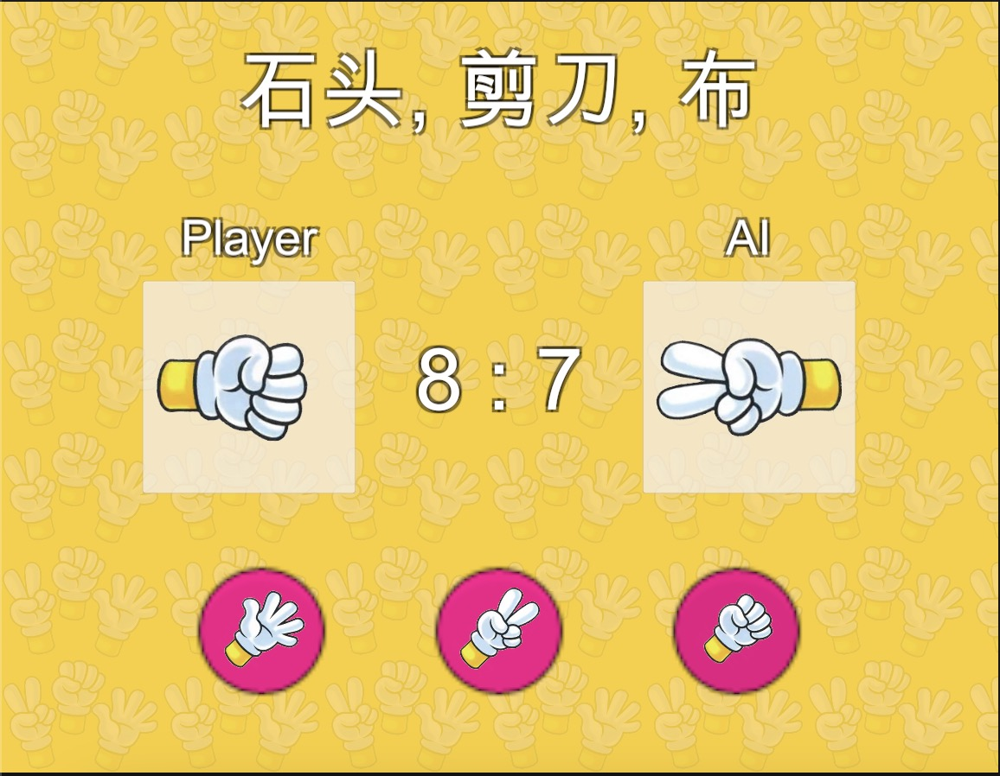

# MOOC 游戏引擎及原理

> (6) 参考其他的游戏，制作一个图形用户界面，可以包含图片、按钮、滑动条等。

Hi 大家好, 本次的作业是使用 UI 制作一个简单的游戏, 我们来试一下复刻老师给出的石头, 剪刀, 布的游戏:

首先我们先从网上找几个石头, 剪刀, 布的图标

然后利用 UGUI 拼一个简易的 UI, 利用 Image 和 Text 来构建基础的游戏 UI:




标题和分数部分使用了 Text 加 OutLine 来实现的

下方的三个按钮使用了 Button 作为基础的控件

最后添加一个简单的 BG图片


在场景中添加一个简单的 GameController 脚本:

对战的核心的逻辑判断如下:

```C#
...

public void OnPlayerCall(IconType type)
{
    var host = type;
    _playerIcon.SetIcon(host);
    
    var guest = GetAiCall();
    _aiIcon.SetIcon(guest);
    
    int result = OnRoundResult(host, guest);
    if (result == 1)
    {
        GlobalState.PlayerScore++;
    }
    else if (result == -1)
    {
        GlobalState.AiScore++;
    }
    
    _score.text = $"{GlobalState.PlayerScore} : {GlobalState.AiScore}";
}


private IconType GetAiCall()
{
    int t = Random.Range(0, 3);
    return (IconType) t;
}


public int OnRoundResult(IconType host, IconType guest)
{
    var hostVal = (int)host;
    var guestVal = (int)guest;
    
    if (hostVal == 2 && guestVal ==0) return -1;
    if (hostVal == 0 && guestVal == 2) return 1;
    if (hostVal == guestVal) return 0;
    if (hostVal > guestVal)
    {
        return 1;
    }
    else
    {
        return -1;
    }
}

... 
```


最后的游戏效果:



作业完成不易, 希望大家能给个高分, 只要有内容我也会给 10 分, 谢谢!