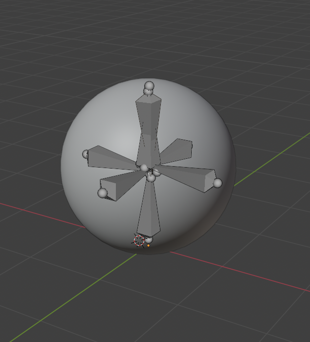
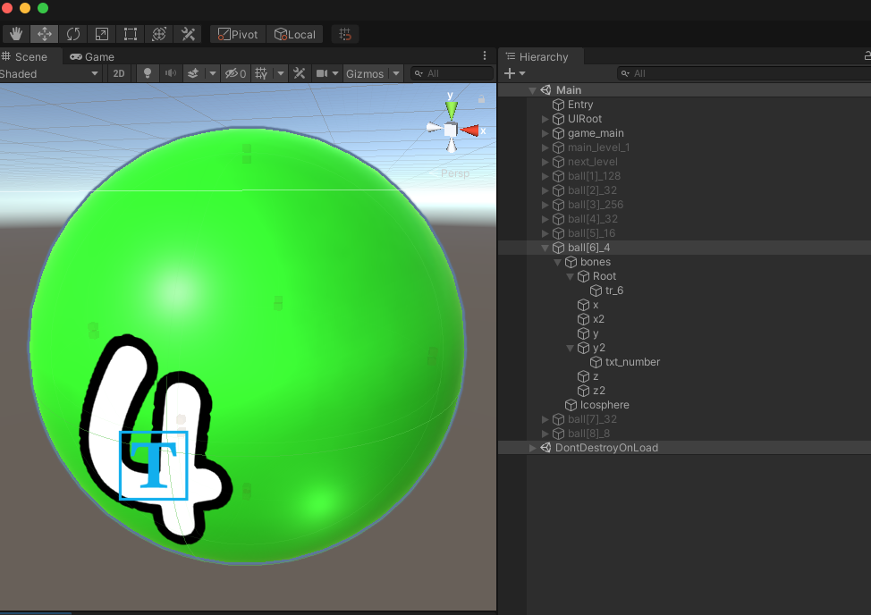
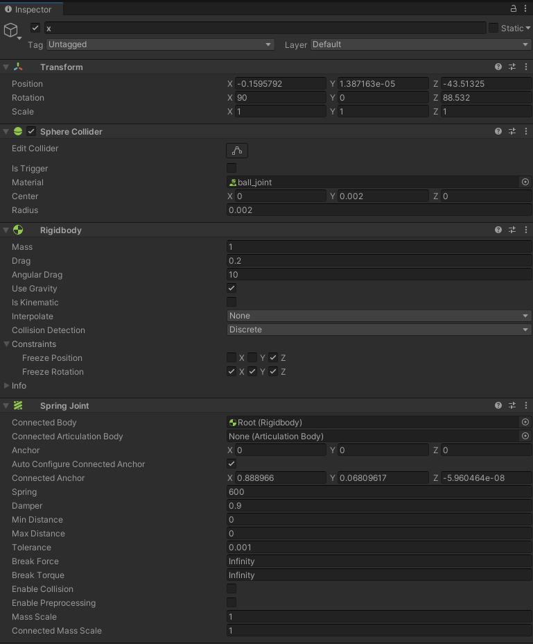
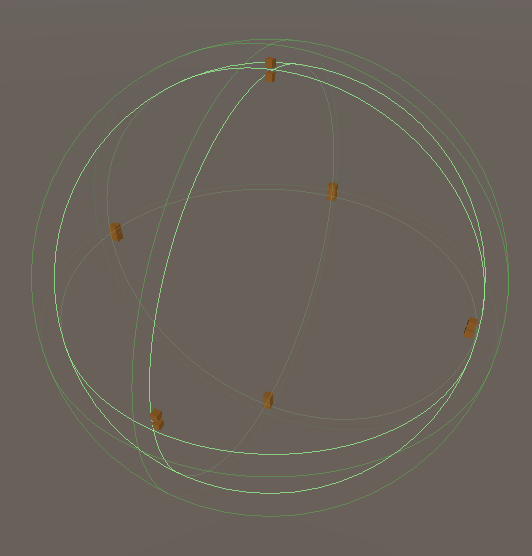

# MOOC 游戏引擎及原理

> (7) 制作一个物理系统的场景，运用到本章的物理相关组件，尽量添加代码使之可以交互。

Hi 大家好, 本次我这边尝试仿照网上的休闲游戏, 建立一个基于柔体 `SoftBody` 的2048 合成球游戏

我们先看一下游戏 Demo 完成的整体效果

# 柔体构成

游戏中最核心的应该就是类似于 <水球> 感觉的柔软球体.

柔体区别于刚体, 在相互碰撞的时候会产生一定的挤压形变, 但是基础形状不会破损.

我是这样建立一个柔体的:

## 模型建立

- 首先, 我们需要先制作一个特殊的球体, 这里我用到了 Blender 作为建模工具, 建立一个简单的 Sphere 球体
- 然后为这个球体, 基于中线点建立下图的骨骼并执行自动蒙皮操作.
- 注意骨骼的分布类似于 "米" 字型, 在内部支撑整个球体的基本形状. 同时方便我们之后的碰撞绑定刚体和弹簧关节

## 关节连接:

将这个模型导入到 Unity 内, 我们需要为内部的所有 Bone 绑定刚体 Rigibody 和碰撞体 Collider

由于内部类似于伞状结构支撑, 以中心的骨骼作为支点, 所有的外围骨骼同中心骨骼进行弹簧关节 `Spring Joint` 链接, 并设定好对应的弹性系数.

关节需要锁定旋转, 只在轴线上进行伸缩.

松弛状态下, 基础力可以支撑球形的外观, 落地后成为馒头状.

## 基础形状维持

由于我们想要维持基础的球形, 同时保有外围形变, 中心骨骼的 Collider 的大小决定了基础形状的大小. 

简单来说, 就是调整中心骨骼球形碰撞盒的半径.

同时, 为了保证外围骨骼的形变, 我们需要调整弹簧关节的弹性系数, 

使得外围骨骼在碰撞后有一定的形变, 但是在碰触中心碰撞盒时可被阻挡和反弹.

## 碰撞检测

水球之间碰撞响应, 是通过本球中心碰撞盒接触到对方的外围 Trigger 碰撞盒来实现的.

实际上, 在中心外部, 我还附加了一个 1.1 倍的 Trigger 碰撞盒, 用于检测其他小球的碰撞.

合成逻辑可通过碰撞后检测两个小球携带的数值参数是否一致来决定触发合成动画的流程.

## 手感实现

这个在实操的时候感觉还是很难调整到一个理想的状态. 因为受力是不可控的, 有时候又会出现一些奇怪的形变.

只能在不断的实践中一步步完善和微调手感.

当前的 Demo 仍有很多不足, 但是我想这个是一个很好的开始.

 

---

> 作业完成不易, 希望大家能给个高分, 互评环节只要有内容我也会给10分, 谢谢!

