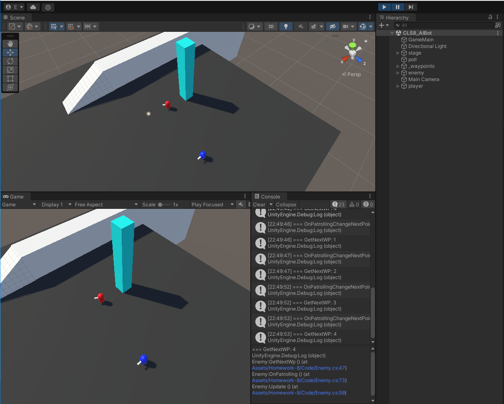
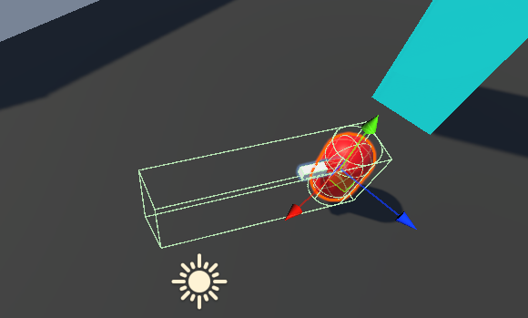
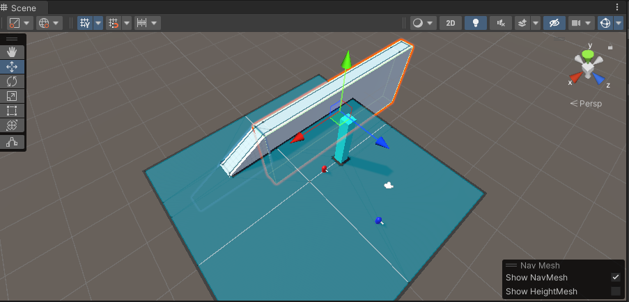

本次作业需要完成基于 NavMesh 的寻路和角色的有限状态机。

我们先简单制作一下场景必要组件

- 制作玩家和敌人两个对象

- 制作敌人的巡逻中心柱， 并环绕柱子配置4个路点作为巡逻的路径目标

- 为玩家编写代码，响应鼠标点击。

- 为敌人编写代码， 初始化开始沿路点巡逻。

制作敌人的有限状态机， 分为 巡逻， 巡逻等待， 追赶， 空闲 等状态

然后制作敌人的视野， 选择狭长形的长方体碰撞盒， 设置为Trigger。 然后再代码中编写近似的逻辑：

- 当玩家角色触发视野后， 获取玩家对象并作为追踪目标

- 在Update内。 每帧更新Enemy对象和巡逻中心柱的距离， 当距离超过预设的追踪距离后。 状态切换为 《巡逻》，并将路点设置为第一个路点

- 如果想要返航的效果好，可在超出范围后先将代表视野的触发盒隐藏1s。 然后再打开。

- 当敌人的主体碰触到玩家后， 玩家对象返回出生位置。

最后别忘了设置所有的可行走路径， 并再NavMesh 的设置面板内进行地形的烘焙。 确保寻路的正确性：

以上Demo可完成简单的追击和超出的逻辑。

作业制作不易， 希望大家能打10分。 作业互评只要有内容一律给10分！